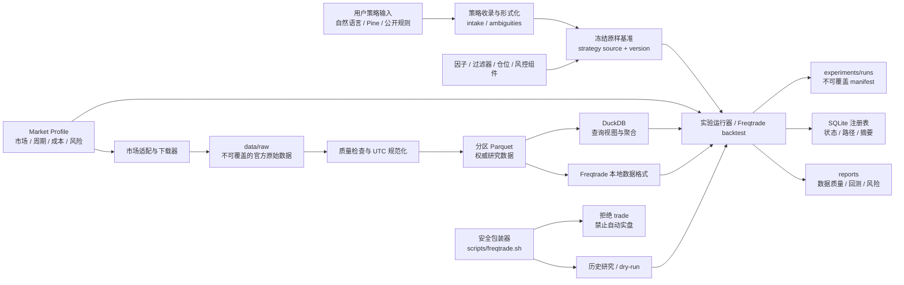
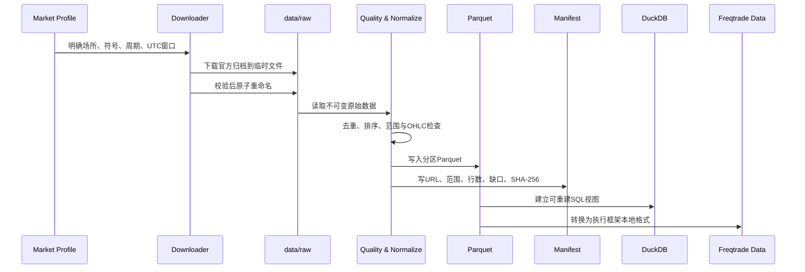
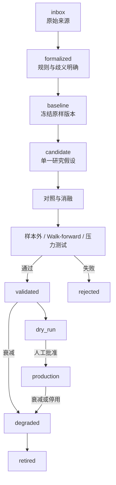

# 系统架构

## 架构目标

Quant Research Lab 的架构围绕六个质量属性设计：

1. **可复现**：相同代码、数据版本、参数、成本和随机种子应得到可核对结果。
2. **轻量**：个人单机可运行，不依赖数据库服务、容器或常驻集群。
3. **可审计**：原始来源、失败实验、状态变化、数据缺口和人工批准均可追溯。
4. **市场隔离**：公式可以复用，但数据语义、实现和验证状态按 market profile 分开。
5. **安全默认**：历史研究优先，实盘关闭，密钥不入项目，`trade` 默认阻止。
6. **可扩展**：未来可以增加新市场、策略组件和自动化，而不重写已有权威数据和记录。

## 总览



## 分层架构

### 1. 输入与配置层

职责：保存用户原始意图、研究边界和可执行配置。

| 组件 | 位置 | 职责 |
|---|---|---|
| 策略收录模板 | `configs/strategy-intake.example.yaml` | 来源、原始描述、歧义、基准和验收门槛 |
| 项目配置 | `configs/lab.json` | 当前资产、市场、周期、窗口、成本和安全模式 |
| Market Profiles | `configs/market_profiles/` | 场所、符号、数据需求和市场特有风险 |
| Freqtrade 配置 | `configs/freqtrade*.json` | 回测/模拟盘参数，不保存密钥 |
| 研究任务配置 | `configs/research/` | 某一阶段的明确研究范围和限制 |

配置文件使用 JSON/YAML，便于人类审阅、自动校验和 Git 版本管理。

### 2. 市场适配与数据采集层

职责：把通用研究需求翻译成具体场所的数据接口、符号和时间语义。

当前实现：

- `scripts/download_binance_vision.py`：下载 Binance 官方永续历史归档；
- OKX profile：定义目标主研究市场，但当前公开 API 网络不可达；
- Binance profile：定义对照场所和当前实际历史数据来源；
- 统一符号：`ETH/USDT:USDT`；场所原生符号分别记录。

下载器执行：ZIP CRC、官方 checksum（可用时）、SHA-256、UTC 时间过滤、重复检查、
间隔检查、OHLC 关系检查和原子写入。raw 文件存在时只读取并校验，不覆盖。

### 3. 存储层

| 存储 | 用途 | 权威性 |
|---|---|---|
| Parquet | OHLCV、mark/index、funding、OI、因子值、交易明细 | 规范研究数据权威层 |
| DuckDB | 跨 Parquet SQL、视图、日报周报查询 | 可重建查询层 |
| SQLite | 因子、实验、状态、路径和摘要 | 小型注册元数据 |
| JSON/YAML | 配置、数据 manifest、实验 manifest | 可版本化控制面 |
| Markdown/HTML | 产品文档、研究报告、风险和绩效报告 | 人工审阅层 |

原始官方数据位于 `data/raw/`，只追加不覆盖。规范 Parquet 位于 `data/processed/`。
DuckDB 默认路径为 `data/catalog/quant.duckdb`，可由 SQL 视图重新创建，不是唯一数据源。

### 4. 研究与回测层

职责：运行策略逻辑、计算组件、执行回测和生成交易级结果。

| 组件 | 位置 | 状态 |
|---|---|---|
| 研究代码 | `strategies/research/` | 与执行框架无关的原型 |
| Pine 档案 | `strategies/pine/` | 原始 TradingView 来源和转换结果 |
| Freqtrade 策略 | `strategies/freqtrade/` | 回测和后续 dry-run 策略 |
| Freqtrade 运行时 | `runtime/freqtrade/user_data/` | 本地数据、日志和运行状态 |
| 数据导出器 | `scripts/export_freqtrade_data.py` | 规范 Parquet 转 Freqtrade Parquet |

第一候选默认使用 15m 执行，1h/4h 可作为市场状态过滤，5m 用于执行细化或敏感性。
策略不强制使用全部周期，多周期数据只能使用当时已经完整收盘的信息。

### 5. 注册与治理层

职责：保存生命周期、实验关系和不可违反的研究门禁。

- `factor_library/registry.sqlite3`：本地 SQLite 注册表，由 Git 忽略；
- `factor_library/schema.example.json`：因子来源、公式、适用市场和按市场验证状态；
- `experiments/runs/`：每个 run 的独立、不可覆盖 manifest；
- `src/quant_lab/registry.py`：因子和实验注册逻辑；
- `src/quant_lab/runs.py`：run ID、代码版本和复现字段；
- `AGENTS.md`：自动化代理必须遵守的最高项目规则。

自动研究可以建议 `candidate`、`validated`、`degraded`、`retired` 或 `rejected`，但
`production` 必须人工批准。

### 6. 报告层

职责：把机器结果转换成可审阅的证据。

- `reports/data_quality/`：数据范围、缺口、重复和异常；
- `reports/backtests/`：基准和候选回测；
- `reports/risk/`：成本、回撤和压力测试；
- `reports/daily/`、`reports/weekly/`：自动监控摘要；
- QuantStats：绩效指标和 HTML 报告。

报告不得隐藏失败、使用受污染测试集冒充样本外，或承诺未来盈利。

### 7. 自动化层

- `scripts/run_daily.sh`：初始化注册表并创建每日 run manifest；
- `scripts/run_weekly.sh`：创建周度研究 run manifest；
- `automation/`：本地定时任务模板；
- `scripts/doctor.sh`：环境、依赖、配置和安全状态检查；
- pytest：注册表、运行 manifest、market profile 和数据摘要回归测试。

自动化当前以“创建可审计任务入口”为主。没有启用自动下载、自动优化、自动 dry-run 或
自动实盘。

### 8. 安全边界

- `scripts/freqtrade.sh` 扫描参数并拒绝 `trade`；
- `configs/lab.json` 和 Freqtrade 配置均设置实盘关闭；
- market profile 默认公共数据研究，不含账户凭据；
- `.gitignore` 排除密钥文件、运行数据库、日志、大数据、环境和缓存；
- 实盘授权必须精确到交易所、账户、策略、资金上限和时间窗口；
- 永不使用带提现权限的密钥。

## 数据流



当前 manifest 位于
`data/manifests/binance_ethusdt_perpetual_20260421_20260720.json`。它记录 244 条归档计划、
处理结果、质量指标和缺口，不把缺失 funding/mark/index/OI 当作零。

## 策略流



每个箭头都应对应版本、实验 run 和证据。查看锁定测试后修改策略，必须标记污染并创建
新的锁定区间。

## 多市场架构

```text
通用核心思想
    + market adapter（场所、符号、交易时段、成本、执行规则）
    + market-native factors（funding、基差、展期、公司行为等）
    + 独立 validation_by_market 状态
```

代码复用不等于结论复用。例如动量计算可以共享，但 OKX 永续、Binance 永续和股票日线
必须有独立数据、成本、实验和状态。

## 关键模块映射

| 模块 | 实际文件/目录 |
|---|---|
| 产品与研究原则 | `README.md`、`docs/07-个人量化策略研究工作法.md` |
| 市场模型 | `configs/market_profiles/`、`docs/10-市场适配与因子适用性.md` |
| 当前研究配置 | `configs/lab.json`、`configs/research/eth_usdt_perpetual_stage1.yaml` |
| 数据下载 | `scripts/download_binance_vision.py` |
| 质量 manifest | `data/manifests/`、`reports/data_quality/` |
| 查询层 | `scripts/build_data_catalog.py`、`data/catalog/views_eth_perpetual.sql` |
| Freqtrade 转换 | `scripts/export_freqtrade_data.py` |
| 安全 Freqtrade 入口 | `scripts/freqtrade.sh` |
| 注册表与运行 | `src/quant_lab/registry.py`、`src/quant_lab/runs.py` |
| 自动化入口 | `scripts/run_daily.sh`、`scripts/run_weekly.sh` |
| 测试 | `tests/` |

## 目录树

```text
quant-research-lab/
├── configs/                 # 项目、市场、策略收录和研究配置
├── data/
│   ├── raw/                 # 不可覆盖的原始归档，Git忽略
│   ├── interim/             # 中间数据
│   ├── processed/           # 分区Parquet，Git忽略
│   ├── manifests/           # 可提交的数据清单和校验摘要
│   └── catalog/             # DuckDB文件、SQL视图和小型摘要
├── strategies/              # inbox、Pine、研究原型和Freqtrade策略
├── factor_library/          # 因子生命周期与SQLite注册表
├── experiments/runs/        # 每次实验的不可覆盖记录
├── reports/                 # 数据、回测、风险、日报和周报
├── runtime/freqtrade/       # Freqtrade隔离运行时状态
├── src/quant_lab/           # 注册、run和CLI代码
├── scripts/                 # 安装、下载、转换、查询、安全和自动化入口
├── tests/                   # 自动回归测试
├── docs/                    # 产品、流程、架构和状态文档
└── vendor/                  # 依赖来源、版本、许可证和用途
```

## 部署与运行模式

- 本地单机 macOS arm64；
- uv 0.11.29 位于 `.tools/bin/`；
- CPython 3.12.13 位于 `.tools/python/`；
- 虚拟环境位于 `.venv/`；
- 缓存位于 `.cache/`；
- 不部署 PostgreSQL、TimescaleDB、ClickHouse、InfluxDB 或 Redis；
- 不运行常驻实盘服务；
- Docker 当前未安装，也不是第一阶段依赖。

## Git 边界

提交：

- 源码、脚本和测试；
- 配置模板和不含密钥的实际研究配置；
- market profiles；
- 数据/实验 manifest；
- SQL 视图和小型质量摘要；
- 文档和报告模板。

不提交：

- `data/raw/`、`data/processed/` 大行情；
- Freqtrade 本地行情、日志和交易数据库；
- `.venv/`、`.tools/`、`.cache/`；
- DuckDB/SQLite 本地数据库和 WAL；
- `.env`、密钥、Cookie、密码和账户文件。

## 技术选择

| 技术 | 选择原因 |
|---|---|
| uv | 项目内 Python、快速依赖解析、精确 lockfile 和缓存隔离 |
| Python 3.12 | 当前研究栈兼容，避免污染系统 Python 3.9 |
| Freqtrade 2026.6 | 加密回测、数据格式和后续 dry-run；基础包已足够第一阶段 |
| Parquet | 列式压缩、类型稳定、适合时间序列扫描和分区 |
| DuckDB | 无服务本地 SQL，可直接查询 Parquet |
| SQLite | 小型事务注册元数据，部署成本低 |
| QuantStats | 常用绩效指标和 HTML 报告 |
| pytest | 快速、可重复的工程和配置回归验证 |

没有安装 vectorbt、独立 Optuna、FreqAI 或重型机器学习栈。需要参数研究时优先评估
Freqtrade 现有能力，并先定义搜索预算和防过拟合门禁。

## 已知限制与失败处理

### 实时 API 超时

OKX 和 Binance 实时公共 API 当前超时。系统使用可访问的 Binance 官方历史归档完成数据
工程，但不伪造 `exchangeInfo`。Freqtrade 完整 backtest 因缺少实时市场 metadata 尚未
启动。

### Funding、mark、index 和 OI 缺口

- mark/index：2026-06-29 各缺 96 根 15m；
- funding：缺 57 个 8h 时点；
- OI：缺 3 个 5m 时点。

缺口进入 manifest 和质量报告，不按零、前值或事后信息静默填充。

### DuckDB 可重建

`quant.duckdb` 不是唯一数据源。数据库损坏时，从分区 Parquet 和
`views_eth_perpetual.sql` 重建。

### 原始数据不可覆盖

已存在 raw 文件只校验和复用；修订产生新数据版本和 manifest，不修改原始文件。

## 扩展点

按需可以增加：

- 新交易所 market adapter；
- 股票、期货、外汇和期权 profile；
- Pine 到 Python/Freqtrade 的策略转换；
- 策略注册表和按市场验证表；
- 更长历史和多市场状态；
- dry-run 监控与日报；
- 组合相关性和策略衰减监控。

第一阶段明确不提前建设：数据库服务、实时多机写入、复杂数据湖、大规模机器学习、上千
组合暴力搜索、自动生产晋升和自动实盘。
