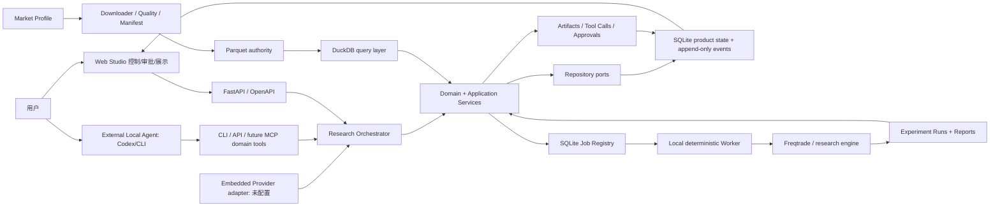
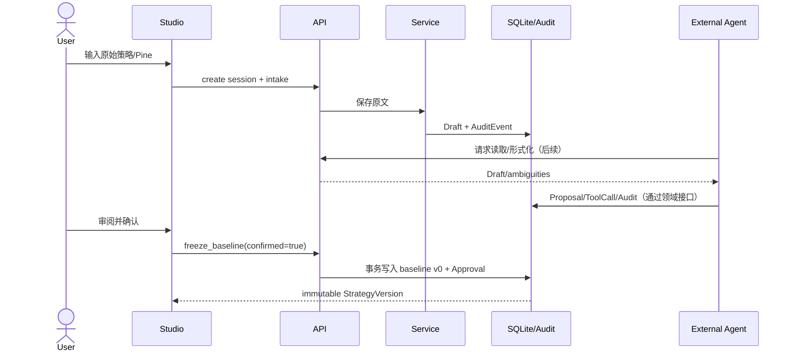
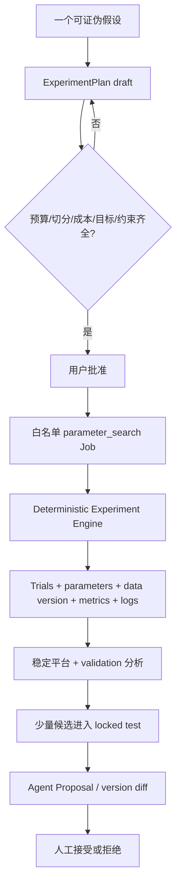

# 产品化目标架构 v1

## 1. 架构决策

目标架构采用 **Agent-first hybrid architecture**：研究内核、应用服务和领域白名单是权威接口，External Agent、Web 和未来 Embedded Provider 都是客户端。Web 不替代本地 AI，也不把 AI 行为藏在聊天框中；所有关键动作写入同一控制平面与 append-only 审计日志。

架构一次冻结，功能渐进：现在只实现本地单用户最小纵切，未来增加 Provider 或 Execution Target 时复用同一 ResearchSession、StrategyVersion、ExperimentPlan、AgentRun、Job、Trial、Approval、Report 和 AuditEvent 协议。

## 2. 总览

安全事实：API 没有 live trade、密钥、生产晋升或任意 Shell；Worker 只接受领域白名单 Job。

## 3. Provider 与 Execution Target 二维模型

| 维度 | 值 | Phase 0 | 说明 |
|---|---|---:|---|
| Agent Provider | `external_local_agent` | 支持/优先 | Codex、未来 Claude CLI/MCP |
| Agent Provider | `embedded_cloud_provider` | 未支持 | 平台托管模型，后期评估 |
| Agent Provider | `byok_provider` | 未支持 | 后期密钥托管与安全设计 |
| Agent Provider | `local_model_provider` | 未支持 | 后期 Ollama/LM Studio adapter |
| Execution Target | `local_runtime` | 支持/优先 | 本地数据、SQLite、Worker、Freqtrade |
| Execution Target | `hosted_sandbox` | 未支持 | 后期隔离计算环境 |

Phase 0 固定 `external_local_agent + local_runtime`。这两个枚举不互相依赖；同一 Agent Provider 未来可选择不同执行目标。

### 3.1 未来产品分层

- **Advanced/Privacy**：云或本地控制台 + Local Connector + 本地 Agent/本地数据；
- **普通 Web**：托管 AI + Hosted Sandbox；
- **混合模式**：云 Web 控制任务，本地 Connector 主动出站轮询，不开放本机入站端口。

后期云模式必须单独解决租户隔离、数据驻留、策略隐私、密钥托管、资源配额、成本归属和审计留存。Phase 0 不建立任何假实现。

## 4. 分层与职责

| 层 | 当前目录 | 职责 |
|---|---|---|
| Domain | `src/quant_lab/domain/` | 实体、状态、不可变规则、Provider/Target 枚举 |
| Application | `src/quant_lab/application/` | 用例、审批门禁、Job 白名单、LLM/工具端口 |
| Infrastructure | `src/quant_lab/infrastructure/` | SQLite、项目/数据只读器、未配置 LLM adapter、旧注册表适配 |
| API | `src/quant_lab/interfaces/api/` | OpenAPI、localhost CORS、请求验证和错误映射 |
| CLI | `src/quant_lab/interfaces/cli/` | 兼容现有 `python -m quant_lab.cli` |
| Worker | `src/quant_lab/workers/` | 注入式白名单 Handler；Phase 0 无回测 Handler |
| Web | `apps/web/` | 控制平面、审计、审批和结果显示 |

现有 `quant_lab.registry`、`quant_lab.runs` 和 CLI 入口保持兼容。因子注册表暂不强行并入产品数据库。

## 5. 控制平面与 Research Orchestrator

控制平面围绕以下对象协调：

- AgentRun / AgentStep：计划和步骤状态；
- ToolCall：工具名、脱敏输入、脱敏输出和状态；
- Artifact：策略、diff、manifest、Run、报告、日志；
- Approval：用户批准/拒绝记录；
- ExperimentPlan / Trial：确定性实验批次；
- AuditEvent：append-only 事实时间线。

External Agent 与未来 Embedded Provider 都必须通过 `ResearchToolGateway` 等领域端口请求动作。网页不根据聊天内容猜测状态，而是读取这些结构化对象和事件。

### 5.1 目标工具白名单

`intake_strategy`、`formalize_strategy`、`list_ambiguities`、`freeze_baseline`、`create_experiment_plan`、`approve_experiment_plan`、`run_backtest`、`run_parameter_search`、`get_job`、`get_agent_run`、`compare_runs`、`propose_strategy_version`、`accept_proposal`、`reject_proposal`、`generate_report`。

阶段 0 仅有 Protocol/部分 API。任何未来 MCP adapter 都只能映射这些领域工具，不暴露 `subprocess`、任意文件路径、交易密钥或 Freqtrade `trade`。

## 6. 可观察性与事件

Web Studio 目标展示：

- Agent 当前计划、步骤和每步状态；
- 调用的项目工具；
- 脱敏输入和输出；
- 策略/文件 diff；
- 创建的实验、Trial、报告和 Artifact；
- 等待用户审批的动作；
- 暂停、取消和 Agent 日志时间线。

Phase 0 使用 SQLite `audit_events` 表。字段为：顺序 ID、event_type、aggregate_type、aggregate_id、actor_type、payload_json、UTC created_at。数据库 Trigger 拒绝 UPDATE 和 DELETE。聊天消息不是审计记录的替代品。

未来如果需要流式展示，SSE 只负责传输，SQLite/Artifact 仍是事实源；不因 SSE 引入 Redis/Kafka。

## 7. 策略与审批数据流

baseline 表由唯一索引和应用门禁共同保护。重复冻结返回冲突；没有 UPDATE baseline 的 API。

## 8. 参数优化执行架构

Phase 0 只实现 `ExperimentPlan.approve()` 的约束模型和测试；不安装 Hyperopt/Optuna，不运行参数搜索。

## 9. API 边界

已实现最小路由：

- `GET /health`；
- `GET /api/project/status`；
- `POST/GET /api/research/sessions`；
- `POST /api/research/sessions/{id}/messages`；
- `POST /api/research/sessions/{id}/intakes`；
- `GET /api/strategy-drafts`；
- `POST /api/strategy-drafts/{id}/freeze-baseline`；
- `GET/POST /api/jobs` 与 Job logs；
- `GET /api/data/summary`；
- `GET /api/settings/status`；
- `GET /api/agent/status`；
- `GET /api/audit/events`。

API 默认由脚本绑定 `127.0.0.1`。CORS 仅允许 `localhost:3000` 和 `127.0.0.1:3000`，不开放 `*`。

## 10. 持久化

- Parquet：行情、因子值和交易明细权威层；
- DuckDB：可重建分析查询层；
- `factor_library/registry.sqlite3`：现有因子/实验注册表，兼容保留；
- `runtime/app/quant_lab.sqlite3`：会话、draft、版本、Job、Approval、Report、审计；
- YAML/JSON：Market Profile、配置和 manifest；
- Markdown/HTML：报告。

Phase 0 使用标准库 `sqlite3` 与 Repository Protocol，不引入 SQLAlchemy/Alembic。原因是单用户、单进程写入、少量表和固定 SQLite 目标；显式 `PRAGMA user_version` 足够，避免为未来 PostgreSQL 过度设计。

## 11. Worker

API 只排队。`LocalWorker` 只接受注入的 `backtest`、`data_quality`、`report` 白名单 Handler，拒绝未知类型。Phase 0 默认 Handler 为空，Job 保持 queued，不会把未执行任务标为成功。后续回测 Handler 必须创建 `experiments/runs/` manifest。

## 12. Web

Next.js App Router + TypeScript + Tailwind，TanStack Query 管理 API 状态，Zod 验证 Studio 表单。当前不安装 Lightweight Charts 和 ECharts；等出现真实 K 线/报告需求再增加适配器，避免空依赖。

Web 不直接读 SQLite、DuckDB 或文件系统，不执行 Shell。OpenAPI 是唯一 HTTP 契约；后续前端类型应由 OpenAPI 生成，当前少量手写类型是 Phase 0 过渡项。

## 13. Git 与运行边界

提交代码、配置、schema、文档、小型 manifest 和摘要；不提交 `.venv`、`.tools`、Node modules、`.next`、SQLite/WAL、日志、密钥或大数据。运行模式是本地单机，无常驻实盘服务。

## 14. 已知限制与失败处理

- Embedded Provider 未配置，任何形式化请求必须明确失败，不返回假内容；
- External Agent 尚无 heartbeat/MCP Server，连接状态显示 `awaiting_heartbeat`；
- Job Worker 无回测 Handler，不虚构完成；
- Binance/OKX realtime API 可能超时，缺口不得静默补零；
- funding/mark/index/OI 的已知缺口必须进入报告；
- DuckDB 可重建，原始数据不可覆盖；
- Hosted Sandbox、云多租户、Local Connector 只冻结协议，不实现基础设施。

## 15. 明确不提前建设

多用户 RBAC、云数据库、远程队列、Local Connector、Tauri、完整 MCP Server、LLM 调用、参数优化器、事件总线、图表库、ML 因子工厂和实盘交易均不属于 Phase 0。
