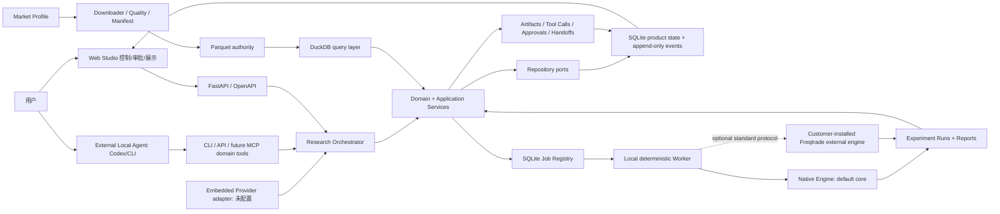
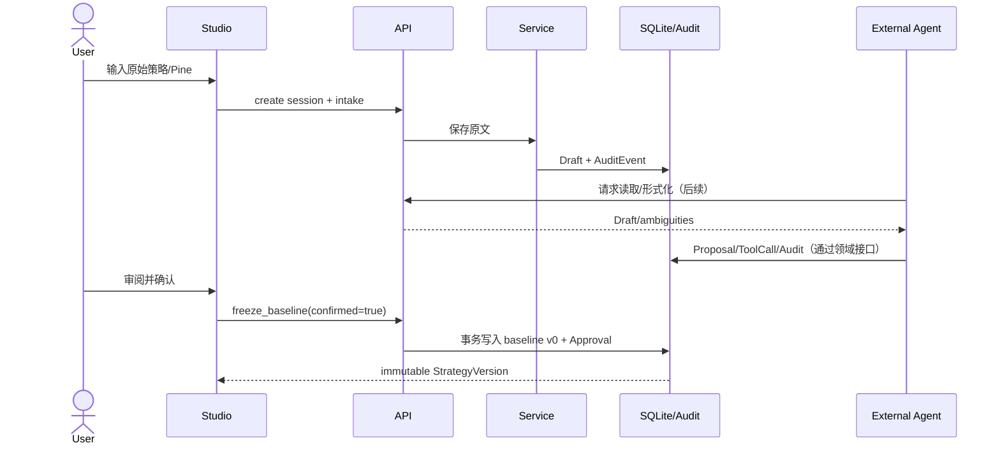
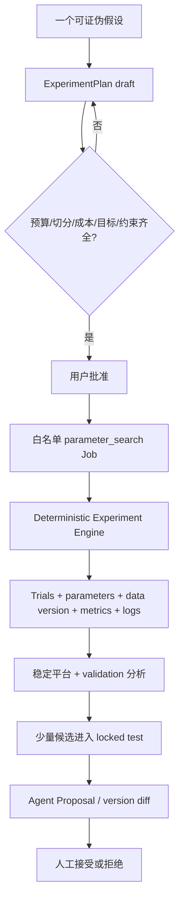

# 产品化目标架构 v1

## 1. 架构决策

目标架构采用 **Agent-first hybrid architecture**：研究内核、应用服务和领域白名单是权威接口，External Agent、Web 和未来 Embedded Provider 都是客户端。Web 不替代本地 AI，也不把 AI 行为藏在聊天框中；所有关键动作写入同一控制平面与 append-only 审计日志。

架构一次冻结，功能渐进：现在只实现本地单用户最小纵切，未来增加 Provider 或 Execution Target 时复用同一 ResearchSession、StrategyVersion、ExperimentPlan、AgentRun、Job、Trial、Approval、Report 和 AuditEvent 协议。

## 2. 总览

安全事实：API 没有 live trade、密钥、生产晋升或任意 Shell；Worker 只接受领域白名单 Job。

## 3. Provider 与 Execution Target 二维模型

| 维度 | 值 | Phase 0 | 说明 |
|---|---|---:|---|
| Agent Provider | `external_local_agent` | 支持/优先 | Codex、未来 Claude CLI/MCP |
| Agent Provider | `embedded_cloud_provider` | 未支持 | 平台托管模型，后期评估 |
| Agent Provider | `byok_provider` | 未支持 | 后期密钥托管与安全设计 |
| Agent Provider | `local_model_provider` | 未支持 | 后期 Ollama/LM Studio adapter |
| Execution Target | `local_runtime` | 支持/优先 | 本地数据、SQLite、Worker、Native Engine；Freqtrade 可选外接 |
| Execution Target | `hosted_sandbox` | 未支持 | 后期隔离计算环境 |

Phase 0 固定 `external_local_agent + local_runtime`。这两个枚举不互相依赖；同一 Agent Provider 未来可选择不同执行目标。

### 3.1 未来产品分层

- **Advanced/Privacy**：云或本地控制台 + Local Connector + 本地 Agent/本地数据；
- **普通 Web**：托管 AI + Hosted Sandbox；
- **混合模式**：云 Web 控制任务，本地 Connector 主动出站轮询，不开放本机入站端口。

后期云模式必须单独解决租户隔离、数据驻留、策略隐私、密钥托管、资源配额、成本归属和审计留存。Phase 0 不建立任何假实现。

## 4. 分层与职责

| 层 | 当前目录 | 职责 |
|---|---|---|
| Domain | `src/quant_lab/domain/` | 实体、状态、不可变规则、Provider/Target 枚举 |
| Application | `src/quant_lab/application/` | 用例、审批门禁、Job 白名单、LLM/工具端口 |
| Infrastructure | `src/quant_lab/infrastructure/` | SQLite、项目/数据只读器、未配置 LLM adapter、旧注册表适配 |
| API | `src/quant_lab/interfaces/api/` | OpenAPI、localhost CORS、请求验证和错误映射 |
| CLI | `src/quant_lab/interfaces/cli/` | 兼容现有 `python -m quant_lab.cli` |
| Worker | `src/quant_lab/workers/` | one-shot 白名单 Handler；当前有 baseline、有边界 Trial、成本压力和 regime validation |
| Web | `apps/web/` | 控制平面、审计、审批和结果显示 |
| Agent Policy | `AGENTS.md`、`configs/agent_policies/` | 指令优先级、强制文档路由、前置条件和审批门禁 |
| Project Skill | `.agents/skills/quant-strategy-research/` | External/Embedded Agent 共用的研究编排流程 |
| Pipeline Policy | `configs/pipelines/` | smoke/fast/full 阶段、AcceptancePolicy、门槛依赖和 Pine 顺序 |

现有 `quant_lab.registry`、`quant_lab.runs` 和 CLI 入口保持兼容。因子注册表暂不强行并入产品数据库。

## 5. 控制平面与 Research Orchestrator

控制平面围绕以下对象协调：

- ResearchSession mode：`quick | guided | expert`、配置修订和 AgentRun pacing；
- AgentRun / AgentStep：计划和步骤状态；
- ToolCall：工具名、脱敏输入、脱敏输出和状态；
- Artifact：策略、diff、manifest、Run、报告、日志；
- Approval：用户批准/拒绝记录；
- ExperimentPlan / Trial：确定性实验批次；
- AuditEvent：append-only 事实时间线。

External Agent 与未来 Embedded Provider 都必须通过 `ResearchToolGateway` 等领域端口请求动作。网页不根据聊天内容猜测状态，而是读取这些结构化对象和事件。

ResearchSession 的模式写入 SQLite。Web、CLI、本地 Agent 和未来 Embedded Provider
共享同一值；AgentRun 未显式给出合法 override 时，由会话模式映射为
`bounded_autonomous`、`guided` 或 `supervised`。模式不授予研究权限。

ResearchSession 同时也是并发隔离边界：一个会话同一时间只允许一个写入型 AgentRun
持有租约。多个 AI 或多个策略需要并行时，默认创建不同 ResearchSession；跨会话结果
不会自动混入同一图表，用户只有主动选择比较对象时才叠加曲线。

### 5.1 目标工具白名单

`intake_strategy`、`formalize_strategy`、`list_ambiguities`、`download_market_data`、`validate_market_data`、`build_data_manifest`、`build_catalog_views`、`freeze_baseline`、`create_experiment_plan`、`approve_experiment_plan`、`create_job`、`run_backtest`、`run_parameter_search`、`get_job`、`get_agent_run`、`compare_runs`、`propose_strategy_version`、`accept_proposal`、`reject_proposal`、`reject_candidate`、`generate_report`、`prepare_dry_run`。

阶段 0 仅有 Protocol/部分 API。任何未来 MCP adapter 都只能映射这些领域工具，不暴露 `subprocess`、任意文件路径、交易密钥或 Freqtrade `trade`。

Pipeline 工具是 `list_pipeline_profiles`、`evaluate_gate`、`create_strategy_outcome`、
`create_component_candidate` 和 `record_regime_validation`。它们将通用政策与价格结构等
策略专用 runner 隔离，下一个策略主要通过配置接入。

回测执行通过 `BacktestEnginePort`/registry 隔离。`native_research` 是当前 smoke、
fast-screen 和 cheap sensitivity 的权威执行器；`freqtrade_2026_6` 是客户自行安装的
可选 external engine，用于第二引擎对账、full validation 和未来 dry-run。Adapter 不
直接 import Freqtrade，不接受 live/trade，也不提供任意 subprocess。既有 Native run
不得追溯改写为 Freqtrade 结果。

## 6. 可观察性与事件

Web Studio 目标展示：

- Agent 当前计划、步骤和每步状态；
- 调用的项目工具；
- 脱敏输入和输出；
- 策略/文件 diff；
- 创建的实验、Trial、报告和 Artifact；
- 等待用户审批的动作；
- 暂停、取消和 Agent 日志时间线。

Phase 0 使用 SQLite `audit_events` 表。字段为：顺序 ID、event_type、aggregate_type、aggregate_id、actor_type、payload_json、UTC created_at。数据库 Trigger 拒绝 UPDATE 和 DELETE。聊天消息不是审计记录的替代品。

未来如果需要流式展示，SSE 只负责传输，SQLite/Artifact 仍是事实源；不因 SSE 引入 Redis/Kafka。

## 7. 策略与审批数据流

baseline 表由唯一索引和应用门禁共同保护。重复冻结返回冲突；没有 UPDATE baseline 的 API。

## 8. 参数优化执行架构

当前已实现通用 Batch Trial 编排、deterministic grid/seeded random、StrategyEvaluator 与
TrialExecutor 端口、显式 retry 和批量 Parquet metrics sink；原单 Trial 分类消融 Handler
继续作为兼容路径。内置 fixture 只用于连线测试，并不代表任意策略已有真实 evaluator。
项目仍不安装或启用 Hyperopt/Optuna，新搜索必须有 Proposal、预算和审批。

## 8.1 门槛与结果分流

SQLite 保存 `gate_evaluations`、`strategy_outcomes`、`component_evidence`、
`component_candidates` 和 `regime_validations`。Viability 失败的完整策略不能创建
strategy candidate/full stress Job；其局部规则只能以独立 lineage 和增量证据保留。
90 日 regime 证据强制停留在 screening/insufficient history。一年数据可进入
`extended_validation` 证据级别，但仍不等于策略/因子 validated 或长期盈利证明。

## 9. API 边界

已实现最小路由：

- `GET /health`；
- `GET /api/project/status`；
- `POST/GET /api/research/sessions`；
- `GET /api/research-modes` 与 `GET/PUT /api/research/sessions/{id}/mode`；
- `POST /api/research/sessions/{id}/messages`；
- `POST /api/research/sessions/{id}/intakes`；
- `GET /api/strategy-drafts`；
- `POST /api/strategy-drafts/{id}/freeze-baseline`；
- `GET/POST /api/jobs` 与 Job logs；
- `GET /api/data/summary`；
- `GET /api/storage/report`；
- `GET /api/backtest-engines`；
- pipeline profile/gate/outcome/component/regime 的只读或受限创建端点；
- `GET /api/settings/status`；
- `GET /api/agent/status`；
- `GET /api/agent/manifest`；
- `GET /api/audit/events`。

API 默认由脚本绑定 `127.0.0.1`。CORS 仅允许 `localhost:3000` 和 `127.0.0.1:3000`，不开放 `*`。

## 10. 持久化

- Parquet：行情、因子值和交易明细权威层；
- DuckDB：可重建分析查询层；
- `factor_library/registry.sqlite3`：现有因子/实验注册表，兼容保留；
- `runtime/app/quant_lab.sqlite3`：会话、draft、版本、Job、Approval、Report、审计；
- YAML/JSON：Market Profile、配置和 manifest；
- Markdown/HTML：报告。

`configs/storage-policy.yaml` 把目录分为 authoritative、rebuildable 和 archiveable，固定
`automatic_deletion=false`。所有 Trial 的指标、manifest、状态和失败原因永久保留；
完整 trades/equity 只对 baseline、关键候选、locked-test 候选或显式保留对象长期保留。
批量 Trial 指标通过 Parquet sink 按执行批次落盘，避免一 Trial 多小文件；SQLite 保存状态、
关键指标、资源使用和 Artifact key。

Phase 0 使用标准库 `sqlite3` 与 Repository Protocol，不引入 SQLAlchemy/Alembic。原因是单用户、单进程写入、少量表和固定 SQLite 目标；显式 `PRAGMA user_version` 足够，避免为未来 PostgreSQL 过度设计。业务对象只保存 project-relative `artifact_key`，由 ArtifactStore adapter 验证并解析，禁止持久化工作站绝对路径。

强制路由和分层执行关系见 [Agent 与 Skill 执行架构](18-Agent与Skill执行架构.md)。

## 11. Worker

API 只排队。`LocalWorker` 是 one-shot 执行器：只有显式 `--job-id` 才执行一个白名单
Job，无 job-id 时只打印 status 并退出，不是常驻队列消费服务。当前注册了基准回测、
有边界的 entry-confirmation Trial、通用 Batch Trial router、成本压力和 ex-ante regime
validation Handler。Full stress
必须在 Service 和 Worker 两层检查同一 subject 的 passed viability。

## 12. Web

Next.js App Router + TypeScript + Tailwind，TanStack Query 管理 API 状态，Zod 验证 Studio 表单。当前不安装 Lightweight Charts 和 ECharts；等出现真实 K 线/报告需求再增加适配器，避免空依赖。

Web 不直接读 SQLite、DuckDB 或文件系统，不执行 Shell。OpenAPI 是唯一 HTTP 契约；后续前端类型应由 OpenAPI 生成，当前少量手写类型是 Phase 0 过渡项。

## 13. Git 与运行边界

Git 与研究状态分离。SQLite、project-relative Artifact、checksum、Approval 和 append-only
Audit/Handoff 是权威事实；Baseline freeze 不等于 commit。Intake、形式化、Gate 和 Job 不得
自动调用 Git。本地产品不依赖 `.git` 或 remote。

Git 只在用户明确备份/发布、显式完整会话 export 或项目代码 release milestone 使用。
允许提交代码、配置、schema、文档、小型 manifest 和摘要；不提交 `.venv`、`.tools`、
Node modules、`.next`、SQLite/WAL、日志、密钥或大数据。现有 tracked 策略历史保留，禁止
为新规则 reset/rewrite/delete。机器规则见 `configs/versioning-policy.yaml`。

## 14. 已知限制与失败处理

- Embedded Provider 未配置，任何形式化请求必须明确失败，不返回假内容；
- External Agent 尚无 heartbeat/MCP Server，连接状态显示 `awaiting_heartbeat`；
- Worker 仅运行注册的 one-shot Handler，无 job-id 不会伪装正在运行；
- Binance/OKX realtime API 直连可能超时；当前可通过用户指定的本机代理读取公开
  metadata，但代理配置不入库、不含凭据；
- funding/mark/index/OI 的已知缺口必须进入报告；
- Freqtrade 零交易 fixture smoke 已通过，但真实策略第二引擎对账仍未完成；
- DuckDB 可重建，原始数据不可覆盖；
- Hosted Sandbox、云多租户、Local Connector 只冻结协议，不实现基础设施。

## 15. 明确不提前建设

多用户 RBAC、云数据库、远程队列、Local Connector、Tauri、完整 MCP Server、LLM 调用、
Hyperopt/Optuna/大规模搜索、事件总线、图表库、ML 因子工厂和实盘交易均不属于 Phase 0。

## 16. 商业交付与模型契约边界

商业首版的部署目标是客户本地安装包或受管容器，Web Studio 仍是本机控制平面。Native
Engine 必须在没有 Freqtrade 时独立工作；Freqtrade adapter 只连接客户自行安装的外部
进程，核心代码不直接 import，商业包不捆绑。该边界避免第三方工具成为核心业务协议。

`configs/agents/agent-manifest.json` 是模型能力的机器可读契约。`AgentManifestReader` 只
读取固定项目路径，API 暴露能力摘要但不接收路径或 Key。Provider adapter 只能归一化
厂商协议；ResearchToolGateway、Approval、baseline 不可变、审计和实盘禁令都位于其
下游，模型能力和厂商更换不能绕过。许可证、安装器、支付、自动更新和真实模型调用仍是
规划项，详见 [本地商业交付与模型兼容策略](23-本地商业交付与模型兼容策略.md)。

## 17. 阶段2治理服务

Product SQLite schema v4 增加 session ResearchBudget，以及 Regime mode/viability lineage；
schema v5 增加 Proposal/Candidate、Batch Trial 和组件逻辑签名字段；当前 schema v6 增加
append-only `research_handoffs`，记录停止原因、完成/未执行动作、用户要求、审批 subject 和
下一建议。
Application Service 在批准 hypothesis、创建 parameter search、使用 locked test 和正式
Regime validation 前进行事务门禁。Worker 从固定 YAML 加载 RSS/时间/并发/batch 政策，
把成功或失败的资源指标写入日志和 audit。

Freqtrade correctness runner 是 external-engine adapter：只执行固定的 lookahead/recursive
命令数组，通过安全 wrapper，不接收任意 Shell。详细契约见
[阶段2研究门禁与资源预算](24-阶段2研究门禁与资源预算.md)。

## 18. 批量研究组件

- `GuidedResearchService`：最多 3 个方向、Proposal 状态机、精确审批和 Candidate snapshot；
- `DeterministicParameterGenerator`：grid/seeded-random 组合与 Plan 预算截断；
- `BatchParameterSearchRunner`：恢复未完成 Trial，跳过已完成结果，汇总稳定区间；
- `ProcessTrialExecutor`：进程并发、超时/RSS 终止和库内线程降载；
- `ParquetTrialMetricsSink`：批次列式指标 Artifact；
- `DefaultComponentEvidenceAggregator`：按逻辑签名聚合多个参数/Trial，绝不自动 validated；
- Studio：改进方向审批、预算调整、Batch 进度、稳定区间与明确 fixture/empty state。

当前 Native 真实策略 runner 尚未普遍适配 `StrategyEvaluator`。下一策略应新增/复用 evaluator
adapter，不新增数据库接口，也不让 Freqtrade external engine 阻塞 Native 核心。详见
[批量策略研究闭环](25-批量策略研究闭环.md)。

## 19. Stop/Handoff 数据流

Application、Pipeline、Proposal 与 Worker 在关键终点写入 `ResearchHandoff`，同时追加
`research_handoff.recorded` AuditEvent。Session 与 AgentRun 只读 API 返回最新一条；Web
不从聊天文本猜测原因。

- freeze 完成但无后续授权：`completed_scope`；
- Proposal：`waiting_user_approval`；
- viability：`gate_failed`；
- ResearchBudget：`budget_exhausted`；
- 可选 Freqtrade 不可用：`blocked_dependency`，Native 核心仍可继续；
- live trade 请求：`safety_refusal`；
- Worker 成功/取消/失败：分别记录完成范围、保留证据或失败原因。

所有 Handoff 都包含明确下一步和精确 subject。自动生成 Handoff 不等于自动执行下一步。

## 20. Scoped Research Control Plane

`ResearchAuthorizationService` 保存 exact subject、阶段范围、预算、到期和阶段事件。
`AuthorizedPipelineOrchestrator` 只在授权范围内推进：pre-viability Gate 失败停止；
viability 失败仅可进入授权列出的 cheap diagnostics。Authorization 不直接执行 Shell 或
策略代码，Worker 仍要求白名单 Job 和注册的 `StrategySpec`/`StrategyEvaluator`。

`ResearchDiagnosticsRunner` 复用 fast-screen trades/signals/metrics 生成 loss attribution，
用 closed-1h/one-bar-lag detector 形成 screening Regime，并创建 deterministic
ComponentHypothesis。运行结果通过一个 Run Bundle、Report、AuthorizationStage 和 Handoff
暴露给 Studio。旧 validation 用于假设时强制标记 screening contaminated。

当前 Strategy plugin registry 已接入 Selective Reentry 的 Native smoke/fast-screen 与
单组件 evaluator。下一策略应新增实现、配置和测试后注册，不修改核心 Worker 条件分支。
详见 [流畅研究授权与失败诊断](26-流畅研究授权与失败诊断.md)。

## 21. 只读图表与第二引擎对账契约

`RunBundleEquityReader` 以 Run Bundle ID 为入口，从注册 Report 获取 run_id，再读取 immutable
manifest 中白名单的项目相对 `equity*.parquet`。API 确定性降采样并返回归一化资金曲线和
回撤，不把大序列写入 SQLite/audit，也不接受任意绝对路径。缺少 Trial equity 时必须返回
明确 unavailable，不从指标伪造曲线。

Freqtrade 第二引擎逐笔对账使用独立状态/创建契约，要求同一 subject、market profile 的
passed viability，且 subject 未 rejected。当前真实 IStrategy 转换和 external executor
标记 `not_connected`，因此只暴露门禁状态，不创建虚假 Job。Native 核心、审批、locked-test
隔离和 live trade 禁令不因 Provider 或外部引擎改变。
