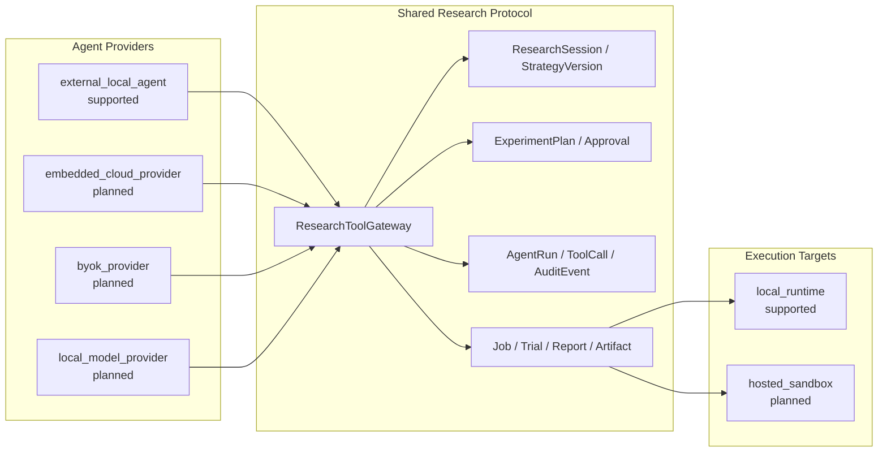

# Agent 与 Skill 执行架构

## 1. 目的

本文件定义 Quant Research Lab 中“谁决定、谁编排、谁执行、谁记录”。目标不是用更长提示词约束 AI，而是让本地 External Agent 和未来线上 Embedded Agent 共用同一组领域工具、状态机、审批与审计协议。

当前优先模式是：

```text
external_local_agent + local_runtime + guided
```

即 Codex 等本地 Agent 读取项目规则并调用安全 CLI/API；Web 显示同一任务、事件、审批和成果。Embedded Provider、BYOK、Local Model、Hosted Sandbox、Local Connector 均是 planned/unsupported。

## 2. 七层职责

| 层 | 解决的问题 | 能否单独保证安全 |
|---|---|---|
| System/Developer Prompt | 平台权限、工具、安全和通用行为 | 不能替代项目业务状态机 |
| `AGENTS.md` | 项目不可违反规则、指令优先级和文档路由 | 不能只靠文字阻止数据库覆盖或 Shell |
| Skill | 为一类任务提供精简、可重复的工作流 | 不能扩大权限或绕过审批 |
| Agent | 理解用户目标、选择 intent、提出计划和调用工具 | 不能直接写生产状态或执行任意命令 |
| ResearchToolGateway | 暴露领域白名单工具 | 是 Agent/API/MCP 的统一能力边界 |
| 后端状态机/Repository | 校验状态迁移、不可变性、路径、审批和审计 | 是关键业务约束的权威执行点 |
| Worker/Experiment Engine | 确定性执行回测、Trial、报告 | 只能处理白名单 Job，不能接受任意 Shell |

### 2.1 指令优先级

1. System、Developer、runtime permission 和平台安全；
2. 用户的明确请求与精确授权范围；
3. 最近的 `AGENTS.md`；
4. `configs/agent_policies/document-routing.yaml` 选出的必读项目文档；
5. 适用 Skill；
6. Agent 默认偏好。

低层不能削弱高层。Skill 是编排说明，不是权限来源。网页文字和聊天确认也不能替代后端 `Approval` 或状态机。

## 3. 强制文档路由

Agent 在行动前先分类 intent：strategy intake、data download、baseline backtest、parameter optimization、stress test 或 dry-run。随后读取 YAML 中 `required_docs` 的完整内容，并逐项验证：

- `required_preconditions`：缺失即停止，不是警告；
- `allowed_tools`：只能调用列出的领域工具；
- `required_outputs`：完成后必须留下机器可读产物；
- `approval_gate`：触发动作前必须存在用户批准。

如果一个请求跨多个 intent，例如“下载数据并回测”，必须合并两组要求，采用更严格的门禁。

每个 AgentRun/AuditEvent 应记录：选择的 intent、读过的文档、前置条件结果、审批、工具、脱敏参数和输出 Artifact。

## 4. Skill 的位置与职责

项目级 Skill 位于：

```text
.agents/skills/quant-strategy-research/
```

该 Skill 只负责：

1. 识别研究 intent；
2. 加载路由 YAML 和必读文档；
3. 检查 Market Profile、baseline、成本、切分、预算等前置条件；
4. 通过 ResearchToolGateway/兼容 CLI/API 调用白名单工具；
5. 保存 manifest、Trial、报告、Artifact 和审计；
6. 在审批门禁处暂停。

Skill 不包含交易秘诀，不承诺盈利，不调用真实账户，不运行任意 Shell，不自行改变 `production`。

## 5. Agent Provider 与 Execution Target

Provider 和执行位置独立：



未来增加线上 Embedded Agent 时，不建立第二套策略或实验对象，只增加 AgentProvider adapter。未来增加 Hosted Sandbox 时，只增加 ExecutionTarget adapter；Artifact、Approval 和审计协议保持不变。

## 6. ResearchToolGateway

目标白名单：

- intake/formalization：`intake_strategy`、`formalize_strategy`、`list_ambiguities`；
- data：`download_market_data`、`validate_market_data`、`build_data_manifest`、`build_catalog_views`；
- baseline/version：`freeze_baseline`、`propose_strategy_version`、`accept_proposal`、`reject_proposal`；
- experiment：`create_experiment_plan`、`approve_experiment_plan`、`run_backtest`、`run_parameter_search`、`compare_runs`；
- observation：`get_job`、`get_agent_run`、`generate_report`。
- dry-run preparation：`prepare_dry_run`（只生成/校验模拟配置，不启动 live trade）。

禁止加入：

- `run_shell(command)`；
- 任意绝对路径读写；
- 密钥获取/保存；
- `live_trade`；
- 自动 production 晋升。

CLI、HTTP 和未来 MCP 都只是这个 Gateway 的 transport adapter，不能各自创造额外能力。

## 7. ArtifactStore 与路径安全

业务对象只保存 project-relative `artifact_key`，例如：

```text
experiments/runs/run_123/manifest.json
reports/backtests/run_123.html
strategies/research/strategy_abc/v1.py
```

禁止保存 `/Users/...`、`file://...`、`../outside` 或其他逃逸项目根的路径。ArtifactStore adapter 负责把 key 安全解析到项目目录，验证归属后再读写。数据库不保存工作站绝对路径，便于本地和未来 Hosted Sandbox 共用协议。

## 8. 状态机执行

### 8.1 baseline

只有显式用户确认才能 `draft → baseline_frozen`。Repository 用唯一约束和事务阻止第二次冻结。Agent 或 Provider 无权覆盖 baseline，只能创建 Proposal/新版本。

### 8.2 ExperimentPlan

只有具备以下字段才能 approved：

- baseline version；
- 单一可证伪假设；
- ParameterSpace；
- Objective 与风险 Constraint；
- train/validation/locked-test；
- 成本模型；
- max Trials 或时间预算；
- 停止条件；
- 用户批准。

`run_parameter_search` Job 必须引用已批准计划。即使 Job 创建成功，Phase 0 Worker 也没有参数搜索 Handler，不会执行或伪造成功。

### 8.3 Trial

每个 Trial 保存 plan、参数、数据版本、状态、指标和日志 Artifact。搜索只能使用 train/validation；locked test 仅对少量候选开放，查看后修改必须标记污染。

### 8.4 AgentRun 与 ToolCall

AgentRun 保存 Provider、Execution Target、run mode、状态和计划摘要。ToolCall 保存领域工具名、脱敏输入/输出和状态。密钥、Cookie、账户标识和提现凭据不得进入 ToolCall 或事件 payload。

## 9. 审计与可观察性

所有关键动作形成 append-only AuditEvent：

- 原始策略保存；
- AI/Agent Proposal；
- baseline 冻结；
- ExperimentPlan 创建/批准/拒绝；
- Job/Trial 状态；
- ToolCall；
- Artifact 创建；
- 报告；
- 暂停、取消、失败和审批。

Web 时间线只读这些结构化事件，不从聊天文本反推事实。SQLite Trigger 当前拒绝事件 UPDATE/DELETE；未来即使更换数据库也保留 append-only 语义。

## 10. Worker

Worker 是确定性执行层，不是自主 Agent。它接收已校验的 Job ID，加载不可变计划和版本，执行注册 Handler，写 Trial/Run/Report/Artifact 和日志。

Phase 0 Handler 为空。后续添加 Handler 时必须：

- 不使用任意 Shell payload；
- 创建实验 manifest；
- 写入数据版本、成本、切分和随机种子；
- 不把 funding/mark/index 缺口静默补零；
- 不启动 Freqtrade `trade`；
- 失败时保留错误和部分 Artifact。

## 11. External Agent 与 Embedded Agent 一致性

External Agent 可以通过 CLI/API/未来 MCP 工作；Embedded Agent 由 Worker 调用 AgentProvider。两者的差异只在 Provider adapter，不在业务权限：

- 都只能生成 draft/proposal；
- 都必须走文档路由；
- 都必须记录 AgentRun、ToolCall 和 AuditEvent；
- 都必须在 approval gate 暂停；
- 都不能覆盖 baseline、运行未批准参数搜索或实盘；
- 都通过 ArtifactStore 使用 project-relative key。

因此 Web 不是本地 Agent 的替代品，而是所有 Agent 模式共享的控制、审计和审批界面。

## 12. Phase 0/本轮边界

本轮实现文档路由、项目 Skill、端口、领域验证、SQLite 最小持久化和测试。不实现完整 MCP Server、LLM 调用、参数优化器、Local Connector、Hosted Sandbox、多用户或远程事件总线。
