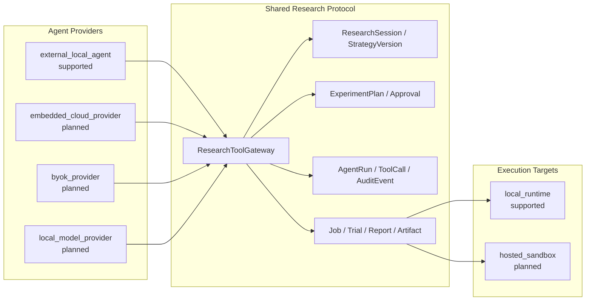

# Agent 与 Skill 执行架构

## 1. 目的

本文件定义 Quant Research Lab 中“谁决定、谁编排、谁执行、谁记录”。目标不是用更长提示词约束 AI，而是让本地 External Agent 和未来线上 Embedded Agent 共用同一组领域工具、状态机、审批与审计协议。

当前优先模式是：

```text
external_local_agent + local_runtime + ResearchSession mode
```

默认会话模式为 `guided`，也可显式选择 `quick` 或 `expert`。Codex 等本地 Agent 先读取
会话模式，再调用安全 CLI/API；Web 显示同一任务、事件、审批和成果。Embedded Provider、
BYOK、Local Model、Hosted Sandbox、Local Connector 均是 planned/unsupported。

模式只决定展示密度、授权范围内的机械连续性和 AgentRun pacing：

| 会话模式 | 默认 AgentRun mode | 默认暂停策略 |
|---|---|---|
| `quick` | `bounded_autonomous` | 只停在关键研究决策与安全门禁 |
| `guided` | `guided` | 关键证据与真正判断点 |
| `expert` | `supervised` | 展示完整阶段并允许更细控制 |

网页、本地 Agent 和未来网页模型都读写 `ResearchSession.research_mode/mode_config`；任何模式
都不能绕过 Baseline、Proposal/Diff、Batch 预算、locked test、dry-run 或 live trade 门禁。

## 2. 七层职责

| 层 | 解决的问题 | 能否单独保证安全 |
|---|---|---|
| System/Developer Prompt | 平台权限、工具、安全和通用行为 | 不能替代项目业务状态机 |
| `AGENTS.md` | 项目不可违反规则、指令优先级和文档路由 | 不能只靠文字阻止数据库覆盖或 Shell |
| Skill | 为一类任务提供精简、可重复的工作流 | 不能扩大权限或绕过审批 |
| Agent | 理解用户目标、选择 intent、提出计划和调用工具 | 不能直接写生产状态或执行任意命令 |
| ResearchToolGateway | 暴露领域白名单工具 | 是 Agent/API/MCP 的统一能力边界 |
| 后端状态机/Repository | 校验状态迁移、不可变性、路径、审批和审计 | 是关键业务约束的权威执行点 |
| Worker/Experiment Engine | 确定性执行回测、Trial、报告 | 只能处理白名单 Job，不能接受任意 Shell |

### 2.1 指令优先级

1. System、Developer、runtime permission 和平台安全；
2. 用户的明确请求与精确授权范围；
3. 最近的 `AGENTS.md`；
4. `configs/agent_policies/document-routing.yaml` 选出的必读项目文档；
5. 适用 Skill；
6. Agent 默认偏好。

低层不能削弱高层。Skill 是编排说明，不是权限来源。网页文字和聊天确认也不能替代后端 `Approval` 或状态机。

## 3. 强制文档路由

Agent 在行动前先分类 intent：strategy intake、data download、baseline backtest、parameter optimization、stress test 或 dry-run。随后读取 YAML 中 `required_docs` 的完整内容，并逐项验证：

- `required_preconditions`：缺失即停止，不是警告；
- `allowed_tools`：只能调用列出的领域工具；
- `required_outputs`：完成后必须留下机器可读产物；
- `approval_gate`：触发动作前必须存在用户批准。

如果一个请求跨多个 intent，例如“下载数据并回测”，必须合并两组要求，采用更严格的门禁。
当前 data download 路由还要求阅读存储治理和年度数据记录；baseline/stress 路由要求阅读
Freqtrade 能力边界，避免把 Native 证据误称为 Freqtrade 结果。

每个 AgentRun/AuditEvent 应记录：选择的 intent、读过的文档、前置条件结果、审批、工具、脱敏参数和输出 Artifact。

## 4. Skill 的位置与职责

项目级 Skill 位于：

```text
.agents/skills/quant-strategy-research/
```

该 Skill 只负责：

1. 识别研究 intent；
2. 加载路由 YAML 和必读文档；
3. 检查 Market Profile、baseline、成本、切分、预算等前置条件；
4. 通过 ResearchToolGateway/兼容 CLI/API 调用白名单工具；
5. 保存 manifest、Trial、报告、Artifact 和审计；
6. 在审批门禁处暂停。

Skill 不包含交易秘诀，不承诺盈利，不调用真实账户，不运行任意 Shell，不自行改变 `production`。

## 5. Agent Provider 与 Execution Target

Provider 和执行位置独立：



未来增加线上 Embedded Agent 时，不建立第二套策略或实验对象，只增加 AgentProvider adapter。未来增加 Hosted Sandbox 时，只增加 ExecutionTarget adapter；Artifact、Approval 和审计协议保持不变。

## 6. ResearchToolGateway

目标白名单：

- intake/formalization：`intake_strategy`、`formalize_strategy`、`list_ambiguities`；
- data：`download_market_data`、`validate_market_data`、`build_data_manifest`、`build_catalog_views`；
- baseline/version：`freeze_baseline`、`propose_strategy_version`、`accept_proposal`、`reject_proposal`、`reject_candidate`（仅允许有明确人工批准和失败证据的 `candidate → rejected`）；
- experiment：`create_experiment_plan`、`approve_experiment_plan`、`run_backtest`、`run_parameter_search`、`compare_runs`；
- observation：`get_job`、`get_agent_run`、`generate_report`。
- dry-run preparation：`prepare_dry_run`（只生成/校验模拟配置，不启动 live trade）。
- pipeline：`list_pipeline_profiles`、`evaluate_gate`、`create_strategy_outcome`、
  `create_component_candidate`、`record_regime_validation`。

禁止加入：

- `run_shell(command)`；
- 任意绝对路径读写；
- 密钥获取/保存；
- `live_trade`；
- 自动 production 晋升。

CLI、HTTP 和未来 MCP 都只是这个 Gateway 的 transport adapter，不能各自创造额外能力。

## 7. ArtifactStore 与路径安全

业务对象只保存 project-relative `artifact_key`，例如：

```text
experiments/runs/run_123/manifest.json
reports/backtests/run_123.html
strategies/research/strategy_abc/v1.py
```

禁止保存 `/Users/...`、`file://...`、`../outside` 或其他逃逸项目根的路径。ArtifactStore adapter 负责把 key 安全解析到项目目录，验证归属后再读写。数据库不保存工作站绝对路径，便于本地和未来 Hosted Sandbox 共用协议。

## 8. 状态机执行

### 8.1 baseline

只有显式用户确认才能 `draft → baseline_frozen`。Repository 用唯一约束和事务阻止第二次冻结。Agent 或 Provider 无权覆盖 baseline，只能创建 Proposal/新版本。

### 8.2 ExperimentPlan

只有具备以下字段才能 approved：

- baseline version；
- 单一可证伪假设；
- ParameterSpace；
- Objective 与风险 Constraint；
- train/validation/locked-test；
- 成本模型；
- max Trials 或时间预算；
- 停止条件；
- 用户批准。

`run_parameter_search` Job 必须引用已批准计划。当前 Worker 保留既定入场确认
single-Trial 兼容 Handler，并增加通用 Batch Trial 编排。Batch 仍必须通过
StrategyEvaluator 端口；没有真实 evaluator 时明确 unsupported，唯一内置 deterministic
fixture 只能作为连线证据，不能伪造策略收益。

### 8.3 Trial

每个 Trial 保存 plan、参数、数据版本、状态、指标和日志 Artifact。搜索只能使用 train/validation；locked test 仅对少量候选开放，查看后修改必须标记污染。

### 8.4 AgentRun 与 ToolCall

AgentRun 保存 Provider、Execution Target、run mode、状态和计划摘要。ToolCall 保存领域工具名、脱敏输入/输出和状态。密钥、Cookie、账户标识和提现凭据不得进入 ToolCall 或事件 payload。

每个写入型 AgentRun 创建时自动取得 ResearchSession 租约。同一会话只允许一个
`queued/running` AgentRun 持有租约；其他 AI 窗口必须等待、只读，或为另一策略创建
独立 ResearchSession。进入 waiting approval、paused、completed、failed 或 cancelled
会释放租约，恢复任务时重新竞争租约。租约由 SQLite 事务校验，并在 Web 显示当前占用
助手，避免仅靠提示词约束多窗口写入。

### 8.5 Pipeline 与 Fail-fast

Agent 先选择 `smoke`、`fast_screen` 或 `full_validation`，然后按
correctness、fast screen、viability、cheap sensitivity、regime/Pine、full validation/
locked/full stress、dry-run 前进。GateEvaluation 是独立事实；任何前置失败必须
`blocked` 或 `failed`，不可由对话跳过。

“少亏”只能创建 diagnostic improvement。组件证据与完整 StrategyOutcome 分开持久化；
失败策略不自动产生 validated factor。Regime 标签必须 ex ante，90 日只是 screening。
完整 Pine 对账后移，Pine 来源早期仍检查 repainting/MTF 和少量 golden trades。

## 9. 审计与可观察性

所有关键动作形成 append-only AuditEvent：

- 原始策略保存；
- AI/Agent Proposal；
- baseline 冻结；
- ExperimentPlan 创建/批准/拒绝；
- Job/Trial 状态；
- ToolCall；
- Artifact 创建；
- 报告；
- 暂停、取消、失败和审批。
- ResearchHandoff/NextAction，包括停止原因、未执行动作、用户要求和下一步。

Web 时间线只读这些结构化事件，不从聊天文本反推事实。SQLite Trigger 当前拒绝事件 UPDATE/DELETE；未来即使更换数据库也保留 append-only 语义。

## 10. Worker

Worker 是确定性执行层，不是自主 Agent。它接收已校验的 Job ID，加载不可变计划和版本，执行注册 Handler，写 Trial/Run/Report/Artifact 和日志。

当前 Worker 是 one-shot：无 `--job-id` 只打印能力/status 并退出，不得在 Web 显示为
正在常驻消费。Full stress Handler 必须自己复查 passed viability，不信任单独的 Agent 说明。

当前 Handler 限于 baseline、一个有边界的入场确认 Trial、通用 Batch router、成本压力测试和
ex-ante regime validation。新增或现有 Handler 都必须：

- 不使用任意 Shell payload；
- 创建实验 manifest；
- 写入数据版本、成本、切分和随机种子；
- 不把 funding/mark/index 缺口静默补零；
- 不启动 Freqtrade `trade`；
- 失败时保留错误和部分 Artifact。

## 11. External Agent 与 Embedded Agent 一致性

External Agent 可以通过 CLI/API/未来 MCP 工作；Embedded Agent 由 Worker 调用 AgentProvider。两者的差异只在 Provider adapter，不在业务权限：

- 都只能生成 draft/proposal；
- 都必须走文档路由；
- 都必须记录 AgentRun、ToolCall 和 AuditEvent；
- 都必须在 approval gate 暂停；
- 都不能覆盖 baseline、运行未批准参数搜索或实盘；
- 都通过 ArtifactStore 使用 project-relative key。

因此 Web 不是本地 Agent 的替代品，而是所有 Agent 模式共享的控制、审计和审批界面。

## 12. Phase 0/本轮边界

本轮实现文档路由、项目 Skill、端口、领域验证、SQLite 持久化和有预算 Batch 编排。
不实现完整 MCP Server、LLM 调用、Hyperopt/Optuna、Local Connector、Hosted Sandbox、
多用户或远程事件总线。

## 13. 模型能力与密钥契约

External Agent 与未来 Embedded/BYOK Provider 共用业务协议，但 Embedded/BYOK 模型还
必须满足 `configs/agents/agent-manifest.json`。门禁要求原生 tool calling、JSON Schema、
多轮 tool results、至少 32K context、指令层级和中英文；禁止 chat-only、提示词模拟工具、
free-text JSON 修补和静默弱模型降级。

Provider adapter 只转换厂商协议，不解释或放宽 ResearchToolGateway 权限。Key 禁止写入
浏览器持久存储、Git、项目配置、SQLite 和日志；本地未来只允许 OS Keychain、环境变量
和进程内存。当前 API 只有 manifest/status 只读端点，不提供 Key 接口或真实模型调用。
商业与分发边界见 [本地商业交付与模型兼容策略](23-本地商业交付与模型兼容策略.md)。

## 14. ResearchBudget、Regime mode 与 Worker budget

Agent 在批准新 hypothesis、创建 search/locked-test Job 前必须读取会话预算。超限只能记录
blocked，不得通过新对话或换 Provider 绕过。Regime diagnostic 可在 viability 前运行但
不得晋升；formal validation 必须引用同 subject 的 passed viability。

Freqtrade correctness 仅映射到 `run_correctness_diagnostic` 白名单工具，Worker 最终执行
固定命令并记录 Artifact。Worker 的时间/RSS/并发/batch 政策同样由代码执行，不依赖 Agent
承诺。详见 [阶段2研究门禁与资源预算](24-阶段2研究门禁与资源预算.md)。

## 15. Batch Proposal 与 Trial 执行

External/Embedded Agent 只能创建最多 3 个结构化 Proposal draft。用户批准精确 Proposal
subject 后，Repository 创建不可变 Candidate；之后 ExperimentPlan 才能进入批量执行。
Agent 不逐个执行 Trial，不在聊天中盲调。Worker 使用进程 executor 和确定性 evaluator，
按计划/会话/资源三层预算运行，并把指标批量写入 Parquet。

失败、取消和资源超限保留已完成 Trial。Retry 必须引用原 Job，仅恢复未完成组合，不再次
预留会话预算，也不覆盖已完成 Trial。组件聚合按规范化逻辑签名去重，不按参数值造因子，
最高自动状态为 component candidate。完整约束见
[批量策略研究闭环](25-批量策略研究闭环.md)。

## 16. Git 不是研究状态机

`configs/versioning-policy.yaml` 是版本边界的机器契约。研究权威状态由 SQLite、项目相对
Artifact、checksum、Approval 和 append-only Audit/Handoff 共同形成。Git 只负责显式备份、
显式会话 export 和代码 release；Agent 不得因 intake、形式化、freeze、Gate 或 Job 成功而
自行 stage/commit/push。本地或商业产品没有 remote 时必须完整工作。

现有 `strategies/` 已跟踪历史不删除、不重写。未来 Artifact 可以只保存在本地权威目录；
需要进入版本化 export 时，用户必须独立明确要求。一次策略批准不能隐含 Git 授权。

## 17. ResearchHandoff 与最终回复

每个研究终点写入 append-only `ResearchHandoff`，并追加 AuditEvent。至少包含 session、可选
AgentRun、subject、标准状态、stop reason、已完成、未执行、用户动作、审批 subject、下一步、
safe-to-continue 和 UTC 时间。

状态语义：

- `completed_scope`：已完成本次授权，但未获得下一阶段权限；
- `waiting_user_approval` / `waiting_required_input`：需要精确批准或必需输入；
- `gate_failed`：证据判定失败，不等于软件故障；
- `budget_exhausted`：硬预算阻止继续；
- `blocked_dependency`：可选依赖或外部条件不可用；
- `safety_refusal`：禁止能力被正确拒绝；
- `failed`：实际执行或系统失败。

Skill 最终回复必须说明当前状态、停止原因、已完成、未执行、用户是否需要操作和精确下一步。
Freqtrade `trade` 的 exit code 3 报告为 `Live trade safety guard: PASS (expected rejection,
exit code 3)`，但不得把底层退出码改成 0。

## 18. ResearchAuthorization 与自动阶段

External Agent 或 Studio 可为一个 exact subject 创建 `ResearchAuthorization`。该对象记录
允许阶段、预算、到期和审批人；Agent 不得把自然语言“继续”当作无限授权。内部 stage
boundary 不再产生重复审批，但 Repository/Worker 必须逐阶段复查。

规则是：

- correctness、smoke、fast-screen 失败即停止；
- viability 失败可在同一授权内继续 cheap loss attribution、`regime_diagnostic` 和
  ComponentHypothesis generation；
- 授权不覆盖组件/参数 Batch、locked test、dry-run、live trade 或 Git；
- Authorization 不是执行证明，没有 reviewed StrategySpec/白名单 Job 时不得声称已运行；
- 已观察 validation 生成的新假设标记 `screening_contaminated`；
- 每次范围完成、Gate 失败或依赖阻塞都写 Handoff 和 Run Bundle。

详见 [流畅研究授权与失败诊断](26-流畅研究授权与失败诊断.md)。
